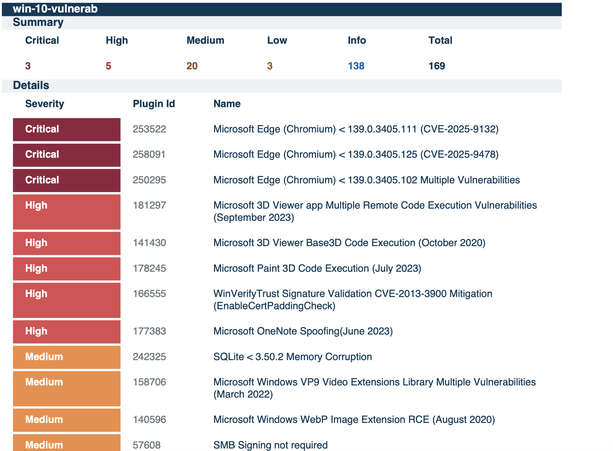
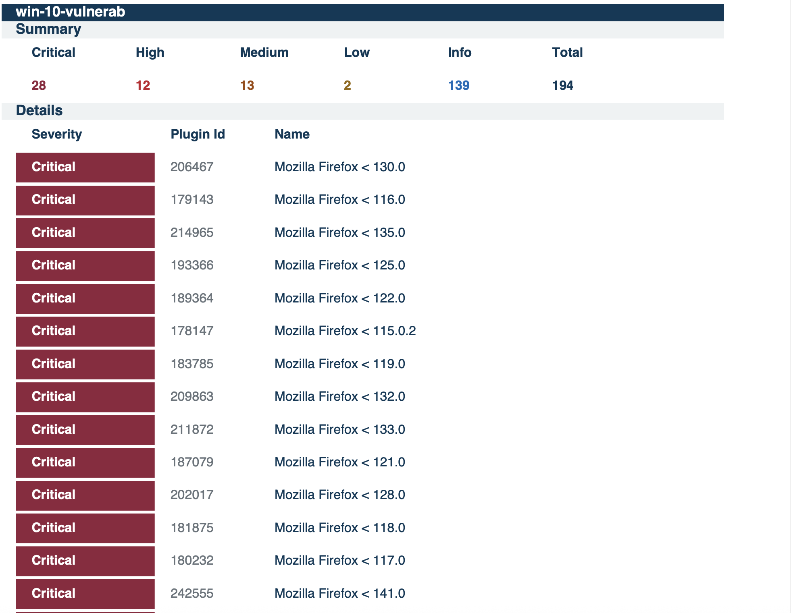
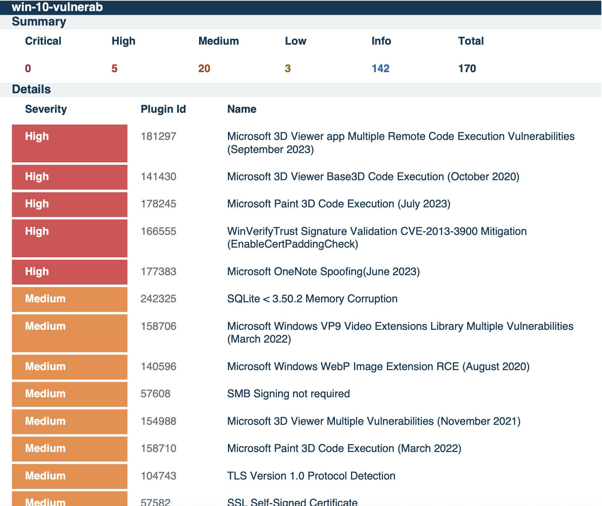

# 🖥️ Windows 10 Authenticated Vulnerability Scan & Remediation

## Overview
This lab demonstrates how to conduct an **Authenticated Vulnerability Scan** on a Windows 10 VM using Tenable.io.  
It covers: provisioning, introducing vulnerabilities, scanning, remediating, and validating fixes.  
The exercise highlights the **full vulnerability lifecycle** used in SOC and vulnerability management operations.  

---

## Steps

### 1. Provision Windows 10 VM
- Create a Windows 10 Pro (Gen2) VM in Azure.  
- Use a **strong username/password** 
- Disable Windows Firewall (`wf.msc`).  

Enable remote administrative access with this PowerShell command (run **as Administrator**):  

```powershell
Set-ItemProperty -Path "HKLM:\SOFTWARE\Microsoft\Windows\CurrentVersion\Policies\System" -Name "LocalAccountTokenFilterPolicy" -Value 1 -Type DWord -Force
2. Configure & Run Initial Authenticated Scan
In Tenable.io, create a scan based on Windows 10 DISA/STIG User Defined Template.

Scanner Type: Internal Scanner (or Cloud Scanner with public IP if required).

Enter VM credentials for authentication.

Launch the scan and export results.

### 🔎 Before Remediation
[](./win-10-scan1.png)

3. Introduce Vulnerabilities
Manually add common vulnerabilities to simulate a real environment:

Missing updates → Leave VM unpatched “out of the box.”

Enable SMBv1 → Legacy insecure protocol.

Install insecure software → Example: Firefox (older version).

Restart the VM.

### ⚠️ After Vulnerabilities Introduced
[](./win-10-scan2.png)

4. Remediation & Rescan
Apply all pending Windows Updates.

Disable SMBv1.

Disable Internet Explorer.

Uninstall insecure software (appwiz.cpl).

Restart VM.

Run a final authenticated scan.

### ✅ After Remediation
[](./win-10-scan3.png)

📊 Vulnerability Comparison
Stage	                        Critical	High	Medium	Low
Before Remediation     Scan 1 |  (3)  | (5) |  (20) |  (3) |
After Vulnerabilities  Scan 2 |	 (28) | (12)|  (13) |  (2) |
After Remediation      Scan 3 |  (0 ) |  (5)|  (20) |  (3) |


Key Takeaways
Authenticated scans provide deep system visibility compared to unauthenticated scans.

Intentionally introducing vulnerabilities simulates real-world attack surfaces.

The remediation cycle = Detect → Analyze → Fix → Validate.

This workflow mirrors daily SOC analyst & vulnerability management tasks.
